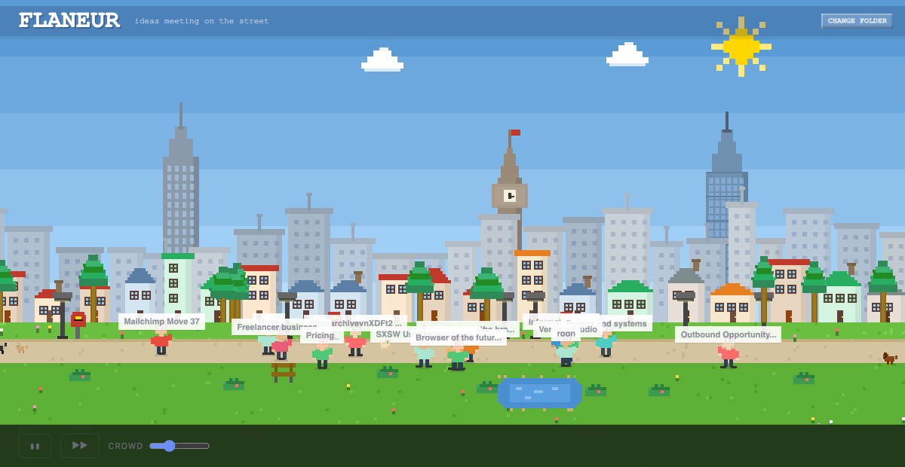

# Let Them Out

**Your notes, set free.**

Your markdown notes become pixel people walking through a city. When two bump into each other, a new idea is born. Invite the best ones to a party. Then pick two for coffee. Each stage refines the ideas further.

**Street → Party → Coffee.** Three stages of creative collision.



## How it works

1. **The Street** — your notes become pixel people walking through a city. Random collisions spark raw ideas. See one you like? Hit **Invite to Party**.
2. **The Party** — your curated guests mingle in a moody lounge. Their street ideas fuse into something deeper. Pick two for **Invite to Coffee**.
3. **Coffee** — two people sit down for a deep conversation. The final idea emerges — refined through three generations of creative collision. Copy it and run with it.

Ideas are generated by Claude using a bisociation creativity framework — finding hidden structural parallels between unconnected ideas and pushing them to their boundaries.

## Install

```
git clone https://github.com/m37daveking/flaneur.git
cd flaneur
pip install .
```

## Usage

```
export ANTHROPIC_API_KEY=sk-ant-...
flaneur walk
```

Open [http://127.0.0.1:7773](http://127.0.0.1:7773) — pick your notes folder and click **Let the notes out**.

### Controls

- **Pause/Resume** — pause the scene
- **Skip** — jump to the next collision
- **Crowd** — more or fewer people on the street
- **Party (N)** — start the party when you've invited 3+ people
- **Coffee (N/2)** — start coffee when you've picked 2 people
- **Back to Street** — reset and start fresh

## Requirements

- Python 3.10+
- An [Anthropic API key](https://console.anthropic.com/)

## What can I point it at?

Any folder of `.md` files:

- Obsidian vaults
- Roam exports
- Bear exports
- A folder of notes you keep in iCloud/Dropbox
- Any collection of markdown files

## The three-generation idea pipeline

| Stage | What happens | Ideas powered by |
|---|---|---|
| Street | Random note collisions | Original note content |
| Party | Curated guest collisions | Street spark ideas fused together |
| Coffee | Deep 1:1 conversation | Full lineage: notes → street sparks → party sparks |

Each stage filters and deepens. The street is wide and random, the party is curated chaos, the coffee is focused synthesis.

## License

MIT
